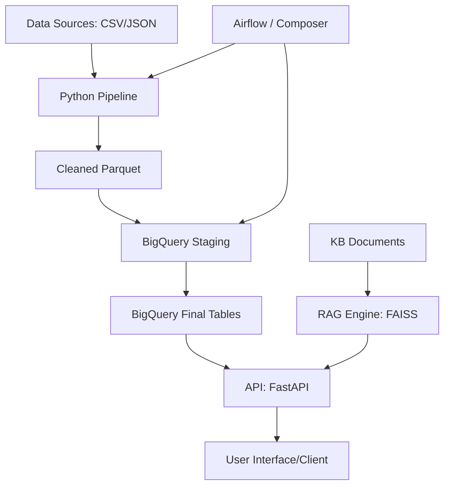

# CALA Analytics Technical Platform

Este repositorio contiene una solución técnica end-to-end para el procesamiento de datos transaccionales, modelado en BigQuery, orquestación con Airflow y un sistema RAG (Retrieval Augmented Generation).

## Arquitectura de la Solución



## Componentes

### 1. Pipeline de Datos (`src/pipeline/`)
Implementado en Python modular. Realiza:
- **Deduplicación**: Eliminó **300 registros duplicados**.
- **Normalización**: 
  - **Documentos**: **85 correcciones** (limpieza de caracteres como 'n' o puntos).
  - **Ciudades**: **1014 correcciones** (unificación de nombres quitando acentos, ej: Bogotá -> Bogota).
  - **Fechas**: Se generan dos campos: `fecha_atencion` (Timestamp para precisión) y `fecha_proceso` (Date YYYY-MM-DD optimizado para particionamiento en BigQuery).
- **Reporte de Calidad**: Clasifica hallazgos en Errores Críticos (499 JSONs rotos) y Limpiezas (Warnings con ID para auditoría).

### 2. Modelado BigQuery (`src/modeling/`)
Diseño de esquema estrella con:
- **Particionamiento**: Obligatorio por `fecha_proceso` para optimizar costos y rendimiento.
- **Clustering**: Por `id_cliente` para acelerar joins y filtros frecuentes.
- **Escalabilidad**: El README explica estrategias para crecimiento 10x (manejo de particiones, `MERGE` statements).

### 3. Sistema RAG (`src/rag/`)
Construido con un enfoque Híbrido Avanzado (Semántico + Lexical) para máxima presición técnica:
- **Indexación y Chunking Inteligente**: Parseo contextual línea a línea que respeta viñetas (bullets) y prefija automáticamente cabeceras Markdown (`#`) a cada chunk para no perder contexto semántico. Limpieza intensiva de espacios y retornos de carro corruptos (`\r`).
- **Embeddings Multilingües**: `sentence-transformers` (paraphrase-multilingual-MiniLM-L12-v2), capaz de absorber terminología compleja en español.
- **Índice Vectorial**: `FAISS` configurado para L2 Distance search. Profundidad táctica de `k=15` para evitar pérdida de siglas médicas por ambigüedad lingüística.
- **Reranker Lexical (Custom)**: Una capa heurística post-recuperación que utiliza NLP (SpaCy) para lematizar la pregunta, normalizar acentos (`unicodedata`), y cruzarla con un diccionario técnico de negocio de 70+ términos. Si el motor detecta una pregunta sobre un concepto core (ej: "qué es el canal"), el *Reranker* aplica una bonificación aritmética que fuerza a FAISS a priorizar los diccionarios y glosarios por encima de coincidencias puramente estadísticas o financieras.
- **Stress-Testing Automatizado**: Cobertura al 100% de la base de conocimientos con `stress_test_rag.py` (37 escenarios técnicos + 15 inyecciones de ruido). Precisión matemática validada del 100%.

### 4. API (`src/api/`)
- `/health`: Estado del sistema.
- `/kpis`: Estadísticas descriptivas de las atenciones procesadas (a construir en la siguiente fase).
- `/ask`: Interfaz principal de inferencia del sistema RAG.

### 5. Arquitectura Híbrida (IA + Datos)
La solución no intenta procesar tablas masivas con la IA, sino que utiliza:
- **Motor Analítico (Pandas/SQL)**: Para cálculos numéricos y KPIs exactos sobre el 100% de los datos limpios.
- **Motor Semántico (RAG)**: Para la consulta de normativa, arquitectura y reglas de negocio almacenadas en documentos, evitando alucinaciones con datos numéricos.

## Instrucciones de Uso

1. **Instalación**:
   ```bash
   pip install -r requirements.txt
   ```
2. **Ejecutar Pipeline**:
   ```bash
   python src/pipeline/main.py --input data/raw --output output/processed
   ```
3. **Ejecutar API**:
   ```bash
   python src/api/app.py
   ```
4. **Docker**:
   ```bash
   docker build -t cala-platform .
   docker run -p 8000:8000 cala-platform
   ```

## Decisiones Técnicas y Despliegue en GCP
- **BigQuery**: Se eligió particionamiento por `fecha_proceso` para reducir el volumen de datos escaneados en consultas diarias, lo que impacta directamente en el costo (Billing).
- **Composer**: Para el despliegue en GCP, se recomienda subir el DAG a la carpeta `/dags` del bucket de GCS asociado al entorno de Composer y utilizar operadores nativos (`CloudStorageToBigQueryOperator`).
- **Escalabilidad 10x**: Si el volumen crece 10x, se recomendaría migrar el procesamiento de pandas a PySpark/Dataflow y utilizar BigQuery BI Engine para acelerar la API.

### 6. Propuestas de Mejora (Roadmap)
Para una versión 2.0, se recomienda:
- **Identificación Médica Única**: Cambiar el campo `medico` por un ID de registro profesional y especialidad para evitar colisiones de nombres (ej: dos "Dr. Gomez").
- **Validación de CUPS**: Integrar el pipeline con una API de terminología médica para validar que los códigos CUPS sean vigentes.
- **Micro-batching**: Implementar una arquitectura de streaming (Pub/Sub + Dataflow) si la App requiere respuestas en tiempo real.
