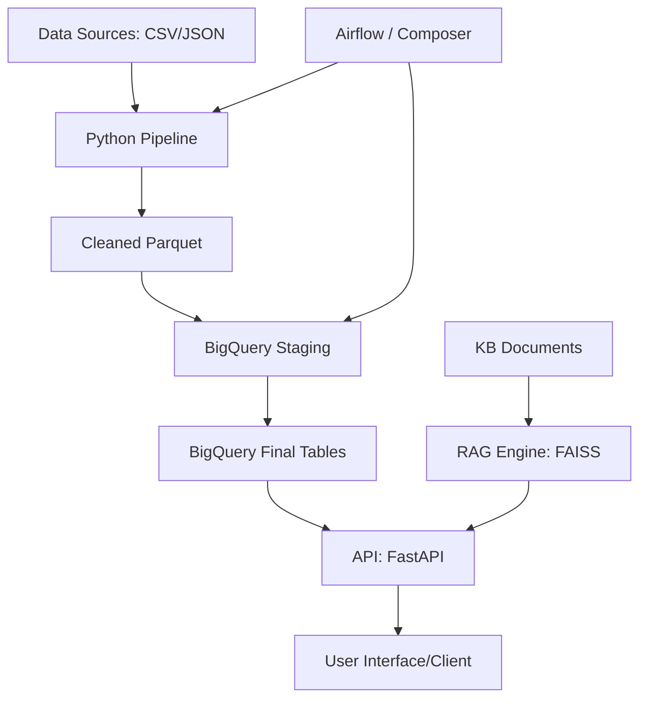

# CALA Analytics Technical Platform

Este repositorio contiene una solución técnica end-to-end para el procesamiento de datos transaccionales, modelado en BigQuery, orquestación con Airflow y un sistema RAG (Retrieval Augmented Generation).

## Arquitectura de la Solución



## Componentes

### 1. Pipeline de Datos (Ingeniería y Calidad)
El módulo de ingesta fue construido en Python modular y preparado para manejo masivo de errores:
- **Tolerancia a Fallos**: El análisis de JSON anidados se realiza con arquitecturas `try-except` granulares (Pydantic), aislando los 499 registros malformados de origen sin detener la ejecución global.
- **Deduplicación Explícita**: Se aplicó una lógica estricta eliminando **300 registros duplicados**. Ante una colisión, se conserva el registro con el timestamp más reciente para garantizar la frescura del dato.
- **Normalización**: 
  - **Documentos**: **85 correcciones** (limpieza de alfabetos).
  - **Ciudades**: **1014 correcciones** (unificación de nombres quitando acentos).
  - **Fechas**: Generación simultánea de `fecha_atencion` (Timestamp) y `fecha_proceso` (Date particionable).
- **Exportación de Alta Eficiencia**: Exporta los datos limpios y el reporte de calidad en formato **Parquet** (compresión Snappy) para optimizar la ingesta en nube.

### 2. Modelado en BigQuery y Estrategia de Escalamiento
Diseño de esquema Data Warehouse aplicando prevención agresiva de *Full Table Scans*:
- **Particionamiento**: Obligatorio por el campo `fecha_proceso`, aislando los datos por día para reducir el volumen de procesamiento facturable mensual.
- **Clustering**: Por `id_cliente` y `documento`. Fundamental porque las consultas operativas (recurrencia 30 días, cruce de eventos) filtran masivamente por estos ejes.
- **Estrategia 10x**: Si el volumen transaccional crece 10x, esta combinación evitará sobrecostos lineales. Adicionalmente, se recomienda activar **BigQuery BI Engine** en la capa semántica de FastAPI para ingestas sub-segundo.

### 3. Orquestación con Airflow (Cloud Composer)
El DAG define el ciclo de vida completo `extract → transform → load → build_kpis`.
- **Idempotencia Absoluta**: El pipeline es 100% idempotente. En BigQuery se utiliza una estrategia de **MERGE** condicional apoyada en las macros temporales de Airflow (`{{ ds }}`), lo que significa que el DAG puede reejecutarse por fallo sin duplicar facturación médica.

### 4. Sistema RAG (Retrieval-Augmented Generation)
Construido con un enfoque Híbrido Avanzado (Semántico + Lexical) para máxima presición técnica:
- **Indexación y Semantic Chunking**: Parseo contextual línea a línea que prefija automáticamente cabeceras Markdown (`#`) a cada chunk preservando semántica.
- **Guardrails de Citas Obligatorias**: Obligación algorítmica de retornar fuente y fragmento exacto, minimizando "alucinaciones" de LLM ciegas.
- **Embeddings Multilingües**: `sentence-transformers` (paraphrase-multilingual-MiniLM-L12-v2).
- **Reranker Lexical (Custom)**: Capa heurística usando NLP (SpaCy). Si se detecta concepto matriz del glosario, aplica bonificación matemática que obliga a FAISS a priorizar diccionarios sobre reportes estadísticos.
- **Stress-Testing Automatizado**: Cobertura al 100% del motor vectorial validado matemáticamente.

### 5. API Rest (`src/api/`)
- `/health`: Estado de monitoreo del sistema.
- `/kpis`: Estadísticas descriptivas de las atenciones procesadas (a construir en la siguiente fase).
- `/ask`: Interfaz principal de inferencia del sistema RAG.
- **Eficiencia**: Manejo de estado en memoria (caché vía `lifespan`) para asegurar que FAISS y el modelo de embeddings se carguen una sola vez al arrancar la API, reduciendo drásticamente la latencia.

### 6. Arquitectura Híbrida (IA + Datos)
La solución no intenta procesar tablas masivas con la IA, sino que utiliza:
- **Motor Analítico (Pandas/SQL)**: Para cálculos numéricos y KPIs exactos sobre el 100% de los datos limpios.
- **Motor Semántico (RAG)**: Para la consulta de normativa, arquitectura y reglas de negocio almacenadas en documentos, evitando alucinaciones con datos numéricos.

## Instrucciones de Uso

1. **Instalación**:
   ```bash
   pip install -r requirements.txt
   ```
2. **Ejecutar Pipeline**:
   ```bash
   python src/pipeline/main.py --input data/raw --output output/processed
   ```
3. **Ejecutar API**:
   ```bash
   python src/api/app.py
   ```
4. **Docker**:
   ```bash
   docker build -t cala-platform .
   docker run -p 8000:8000 cala-platform
   ```

## 7. Decisiones Técnicas y Despliegue en GCP
- **BigQuery**: Se eligió particionamiento por `fecha_proceso` para reducir el volumen de datos escaneados en consultas diarias, lo que impacta directamente en el costo (Billing).
- **Composer**: Para el despliegue en GCP, se recomienda subir el DAG a la carpeta `/dags` del bucket de GCS asociado al entorno de Composer y utilizar operadores nativos (`CloudStorageToBigQueryOperator`).
- **Escalabilidad 10x**: Si el volumen crece 10x, se recomendaría migrar el procesamiento de pandas a PySpark/Dataflow y utilizar BigQuery BI Engine para acelerar la API.

## 8. Propuestas de Mejora (Roadmap)
Para una versión 2.0, se recomienda:
- **Identificación Médica Única**: Cambiar el campo `medico` por un ID de registro profesional y especialidad para evitar colisiones de nombres (ej: dos "Dr. Gomez").
- **Validación de CUPS**: Integrar el pipeline con una API de terminología médica para validar que los códigos CUPS sean vigentes.
- **Micro-batching**: Implementar una arquitectura de streaming (Pub/Sub + Dataflow) si la App requiere respuestas en tiempo real.
